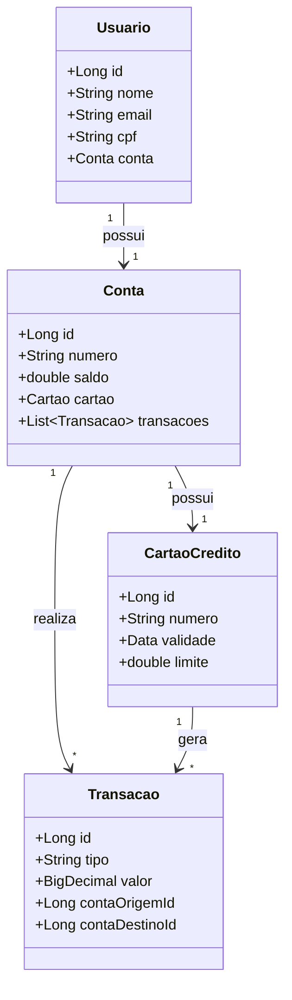

# BOOTCAMP DIO - Bradesco - Java Cloud Native

## Descrição 
Projeto desenvolvido como parte do Bootcamp DIO - Bradesco, com o objetivo de praticar desenvolvimento back-end utilizando Spring Boot. O sistema simula operações bancárias básicas através de uma API RESTful, com endpoints para gestão de clientes, contas, cartões e transações.

## Funcionalidades
### Clientes
- Cadastro de novos clientes
- Atualização de dados cadastrais
- Consulta de informações
- Exclusão de cadastro

### Contas Bancárias
- Abertura de conta vinculada a cliente
- Depósitos e saques
- Transferências entre contas
- Consulta de saldo e limite
- Encerramento de conta

###  Cartão de Crédito
- Emissão de cartão vinculado à conta
- Definição de limite
- Realização de compras
- Cancelamento de cartão

###  Transações
- Histórico completo de movimentações
- Detalhes por tipo (transferência, depósito, compra)

## Tecnologias Utilizadas

- **Linguagem**: Java 
- **Framework**: Spring Boot 
- **Persistência**: 
  - Spring Data JPA
  - Hibernate
  - Banco de dados H2 (desenvolvimento)

## Diagrama

## Referências e Links Úteis 
https://github.com/digitalinnovationone/santander-dev-week-2023-api/tree/main/src
