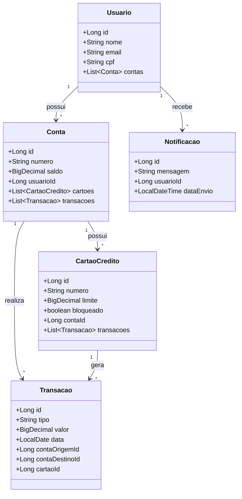

```mermaid
classDiagram

class Usuario {
  +Long id
  +String nome
  +String email
  +String cpf
  +List~Conta~ contas
}

class Conta {
  +Long id
  +String numero
  +BigDecimal saldo
  +Long usuarioId
  +List~CartaoCredito~ cartoes
  +List~Transacao~ transacoes
}

class CartaoCredito {
  +Long id
  +String numero
  +BigDecimal limite
  +boolean bloqueado
  +Long contaId
  +List~Transacao~ transacoes
}

class Transacao {
  +Long id
  +String tipo
  +BigDecimal valor
  +LocalDate data
  +Long contaOrigemId
  +Long contaDestinoId
  +Long cartaoId
}

class Notificacao {
  +Long id
  +String mensagem
  +Long usuarioId
  +LocalDateTime dataEnvio
}

Usuario "1" --> "*" Conta : possui
Conta "1" --> "*" CartaoCredito : possui
Conta "1" --> "*" Transacao : realiza
CartaoCredito "1" --> "*" Transacao : gera
Usuario "1" --> "*" Notificacao : recebe

```
